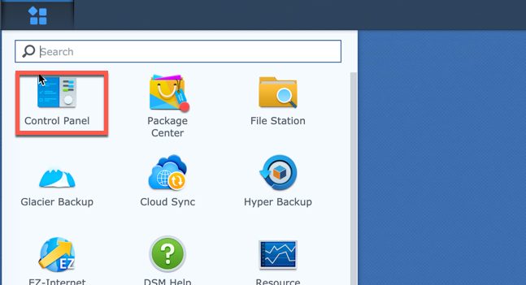

# NordVPN OpenVPN Reconnect Script for Synology Task Scheduler

Bash script that automatically reconnects OpenVPN to the least loaded
recommended serever.

After you created your VPN connection, you should manage the fact that the
server you chose can go offline and your VPN will timeout. Somebody has a kill
switch on their NASes for this case. I decided to go a little further - I wrote
a small script that does the human job here in case it detecs that the VPN is
down:

1. Stops Download Station
1. Goes to NordVPN, asks for a recommended server
1. Chooses the least loaded one
1. Connects VPN to a new server
1. Start Download station
1. Sends a report so you can investigate what happened

## Prerequisite

### Install [jq](https://stedolan.github.io/jq/) and download the script to the disk

Login via ssh and run

```bash
sudo wget -O /usr/bin/jq https://github.com/stedolan/jq/releases/download/jq-1.6/jq-linux32
chmod +x /usr/bin/jq
mkdir /volume1/opt/synordvpn-reconnect
wget -O /volume1/opt/synordvpn-reconnect/runme.sh https://raw.githubusercontent.com/korjik/synordvpn-reconnect/master/runme.sh
chmod +x /volume1/opt/synordvpn-reconnect/runme.sh
```

### Set up OpenVPN

Use Synology oficial guide to set up VPN:

https://nordvpn.com/tutorials/synology-nas/openvpn/

## Create scheduled task

1. Go to Control panel

  

2. Find Task Scheduler

  

3. Create a scheduled task as a user defined script

  

4. Name it and run as root

  

5. Choose the schedule

  

6. Send email on reconnect and put the script path

  
